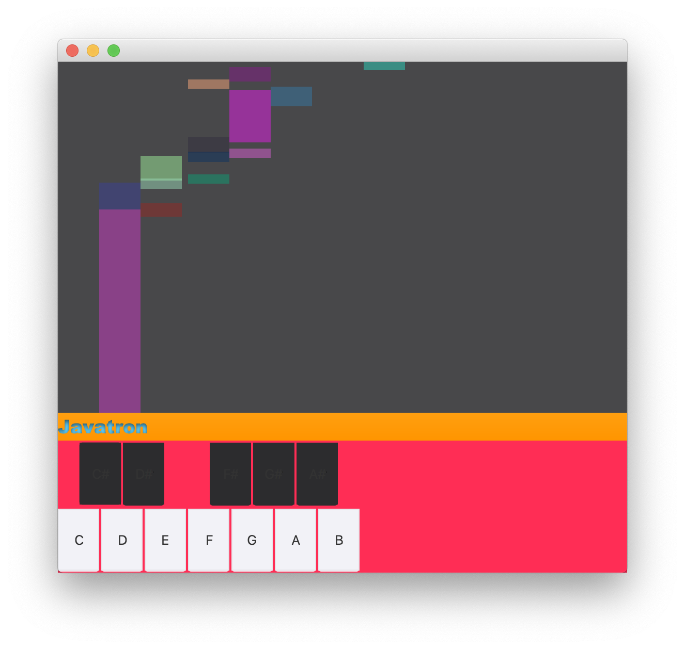
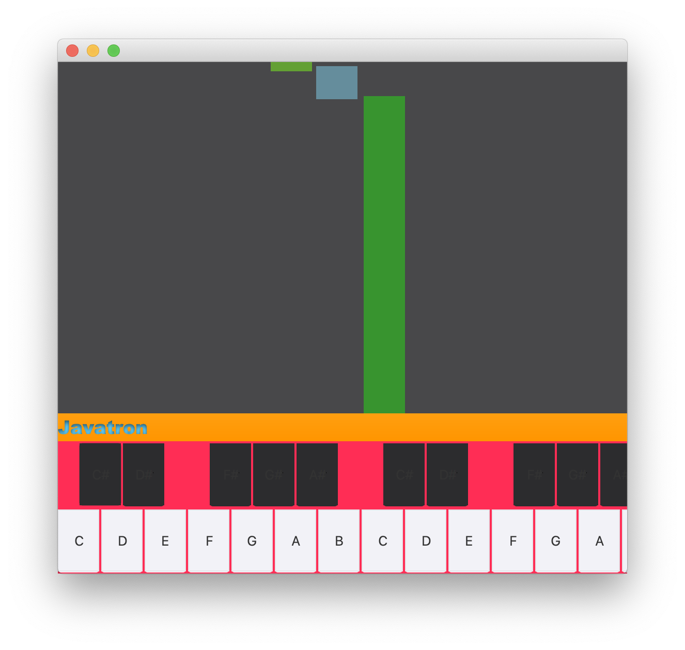

# Sequin

Sequin is an open-source sequencer platform for Musical Instrument Digital Interface (MIDI) development.  I developed this in Fall '19 for the CREATE Symposium at Georgia Gwinnett College.  The topic at hand was JavaFX game development.  I justified the classification by categorizing it akin to Guitar Hero, Synthesia, Rock Band, or the plethora of piano apps that are available for mobile devices.  Most of them, if not all, use MIDI in some fashion.  It is the standard for integrating musical events with computers.

I believe the initial upload to be the exact code I ran at the event.  Excuse the bad coding practices; I made the entire program in about 6 hours or so as the event fell on an exceptionally busy week of mine.  It is conglomerated code with basic functionality, but I wanted to document the software every step along the way.  Aside from some CSS styling, the initial version shows the bare minimum code it takes to make a computer keyboard act as a (non velocity-sensitive) musical keyboard.

It took me a while to figure out the EventListener configuration, so I figured I would make it open-source for the world to use as a reference.  Feel free to use it for informational purposes, personal use, or any other use you may find.  I just ask that you let me know what it is up to around the world so I can get a sense of pride from it!

If you're wondering, the Javatron name is inspired by the Mellotron synthesizer brand.  Sequin is derived from the MIDI term sequencer.

# Quickstart

1. Download the project and run Javatron.java. Notice the keyboard appears in a new window. Behold; it is the Javatron!

2. Note that you may resize the window to a bigger size for a more immersive experience.

3. With your device volume at an appropriate level, press and hold the Q, E, and T keys simultaneously. You will hear and see the Javatron play a C Major chord! Releasing the keys will stop drawing and playing the notes. Note the break in the image below caused by a quick release and repress of the keys.

4. Have some fun with the keys. Here is the keymap:
C: Q
C#/Db: 2
D:W
D#/Eb: 3
E: E
F: R
F#/Gb: 5
G: T
G#/Ab: 6
A: Y
A#/Bb: 7
B: U
| Key      | Note |
| ----------- | ----------- |
| Q      | C       |
| Paragraph   | Text        |

5. Press and hold the shift key. An extra octave will be visible while the shift key is pressed.

6. In the image below, note that pressing a musical key while holding down the shift key will play that note an octave higher.

7. In the image below, observe the ability to quickly and fluently shift octaves while playing scales.

# Developing in Eclipse: Build Path Configuration

This program has been tested and ran on macOS Catalina 10.15.3 (MacBook Pro 2019 w/ TouchBar) using Eclipse IDE 2019-06 (4.12.0).

If you have issues, please make sure that you are using a version of Java that supports JavaFX.  If you are on a recent version, you may need OpenJFX by Gluon.  Once you have JavaFX configured and Sequin set up as a project, proceed to the following steps:

- Right Click Project > Build Path > Configure Build Path
- Click on the Libraries tab
- Expand the JRE System Library (mine is: [JavaSE-1.8]) by clicking the dropdown button
  - It may say: Access rules: No rules defined
- Click on Access Rules
- Click Edit on the right BorderPane region
- Click Add in the new window that pops up
- For Resolution, set it to accessible
- For the rule pattern, type javafx/**
- Click OK on the two windows that popped up, and then Apply and Close

Run Javatron.java

If you have any questions, please message me.  I will respond usually within the same day.  Have fun!

# Credits

I would like to thank Dr. Wei Jin at GGC for convincing me to make a submission to the CREATE Symposium.  Had she not pushed me out of my comfort zone, this project would have never came to be.  Thanks Dr. Jin!
